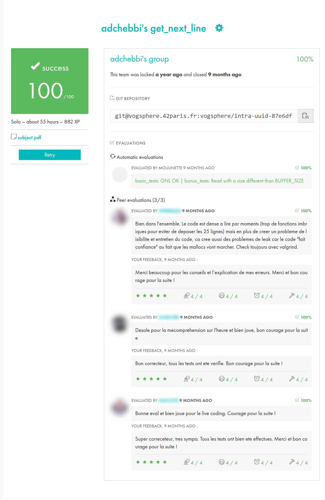

*This project has been created as part of the 42 curriculum by adchebbi.*

# get_next_line

> A C function that returns a file one line at a time, whatever the buffer size, by keeping the leftover data
> between calls in a `static` variable.

  

```c
char *get_next_line(int fd);
```

Each call returns the next line of `fd`, including its `\n` if there is one, as a freshly allocated string that the
caller must `free`. It returns `NULL` at end of file or on error.

## Highlights

- **Works with any `BUFFER_SIZE`**: tested from 1 byte to 10,000,000 bytes, with identical output.
- **Any file descriptor**: regular files, standard input, pipes.
- **Edge cases**: empty lines, last line without `\n`, empty file, invalid fd, `BUFFER_SIZE <= 0`.
- **Leak-free**: Valgrind reports no leaks after reading a whole file.

## Usage

```c
#include "get_next_line.h"

int main(void)
{
    int  fd = open("file.txt", O_RDONLY);
    char *line;

    while ((line = get_next_line(fd)) != NULL)
    {
        printf("%s", line);
        free(line);
    }
    close(fd);
    return (0);
}
```

```bash
cc -Wall -Wextra -Werror -D BUFFER_SIZE=42 main.c get_next_line.c get_next_line_utils.c -o gnl
./gnl
```

## How it works

1. A `static char *` keeps whatever was read past the last returned line.
2. While that stash has no `\n`, read `BUFFER_SIZE` more bytes and append them to it.
3. When a `\n` is found, return everything up to and including it, and keep the rest for the next call.
4. When `read` returns 0, return what is left as the last line (if any) and free the stash.

## Test results

Input: `"line1\nline2\n\nlast-no-newline"`

| `BUFFER_SIZE` | Lines returned |
|---|---|
| 1, 3, 42, 10,000,000 | `line1\n`, `line2\n`, `\n`, `last-no-newline` ✅ |

## Project structure

```
.
├── get_next_line.h        # prototypes, default BUFFER_SIZE (42)
├── get_next_line.c        # read loop, line extraction, stash management
└── get_next_line_utils.c  # string helpers (strlen, strdup, substr, memcpy)
```

## Resources

- `read(2)` man page
- Static variables in C: lifetime and scope

## 42 evaluation

Validated at **100/100** by the Moulinette (automated tests) and 3 peer evaluations.
Other students' names and photos are blurred.

<p align="center"></p>

## Author

**Adem Chebbi** ([@ademchbb](https://github.com/ademchbb)), 42 login `adchebbi`
